## Практическая работа 1. 
## Инсталляция Linux.

> Соответствие LPI101: (102.1 Design hard disk layout)

### Вопросы для самопроверки


---
### Практические задания

1. Установка операционной системы

1.1. В пункте меню выберите установку и изучите экран **"Обзор установки"**
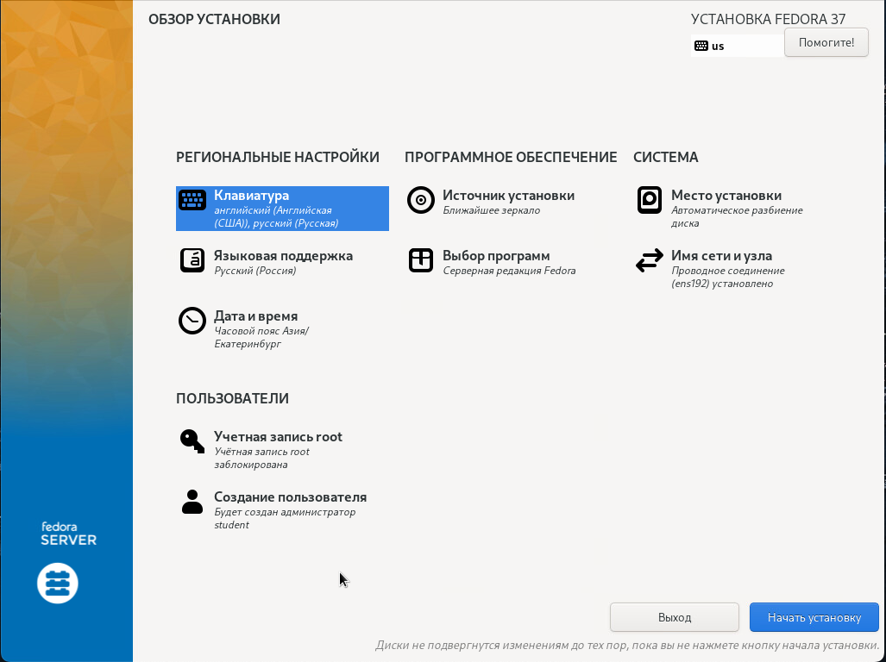

1.2. Задайте порядок раскладки клавиатуры: **английская, русская**
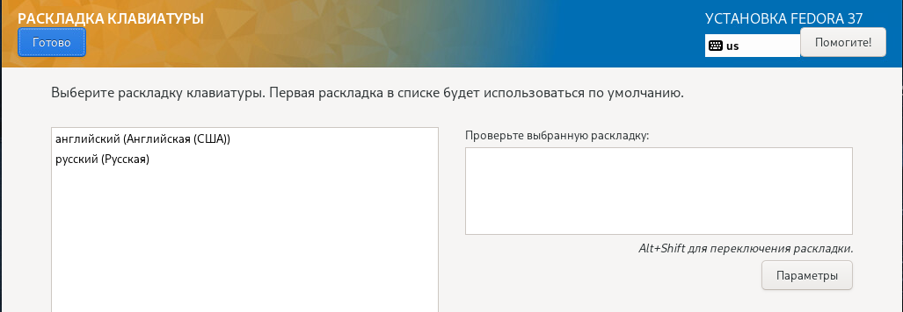

1.3. Языковая поддержка: укажите **"русская"**
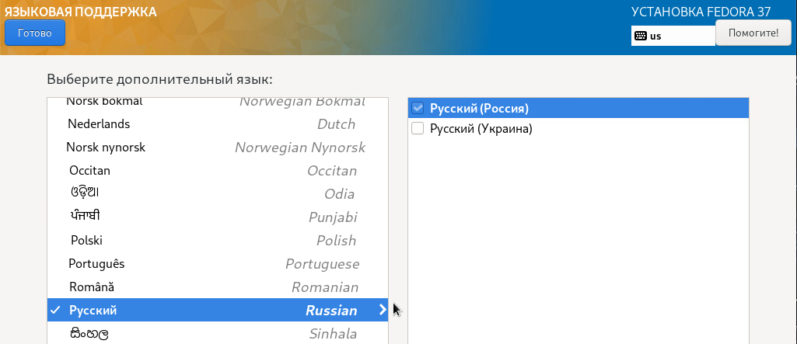

1.4. Задайте **часовой пояс вашего региона**


1.5. Перейдите в **"Место установки"**. Выберите первый диск и укажите конфигурацию устройств хранения **"По-своему"**. Нажмите "Готово".
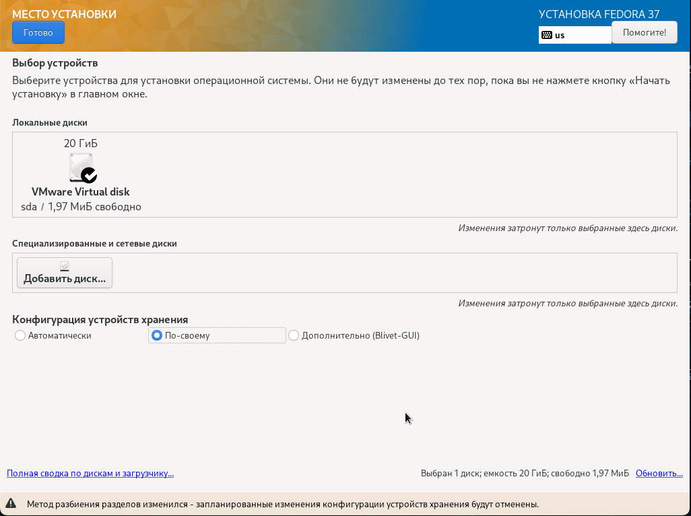

1.6. Убедитесь, что "Схема разбиения для новых точек монтирования" = **LVM**
Нажмите "Создать их автоматически"
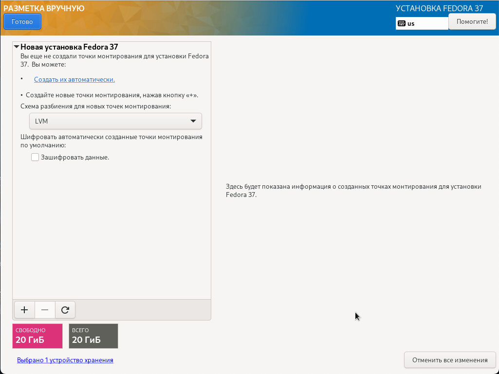
       
1.7. **Создайте разделы** на диске в дополнение к существующим:

- / - 10GiB
- /home - 1GiB
- /tmp - 400MiB
- /srv - 1GiB
- /var - 5GiB
- swap - 1GiB

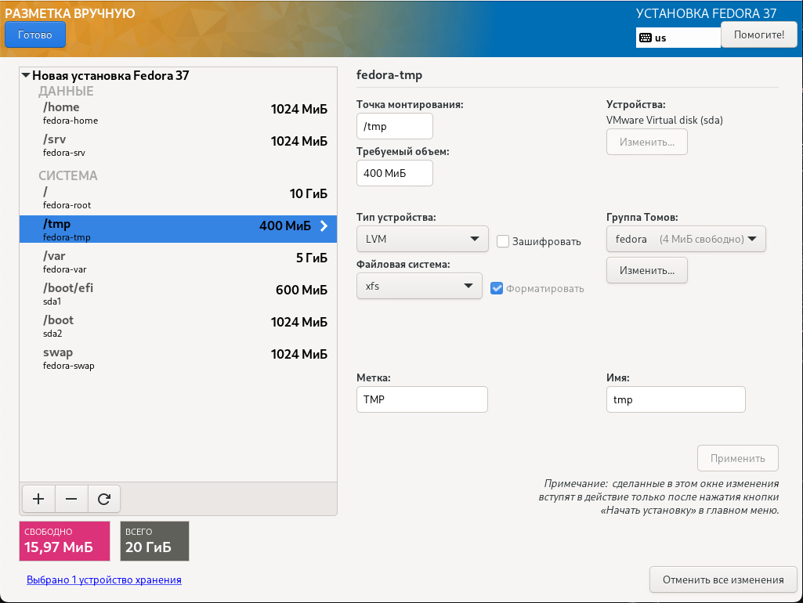

1.8. Для создания точки монтирования необходимо нажать "**+**" 
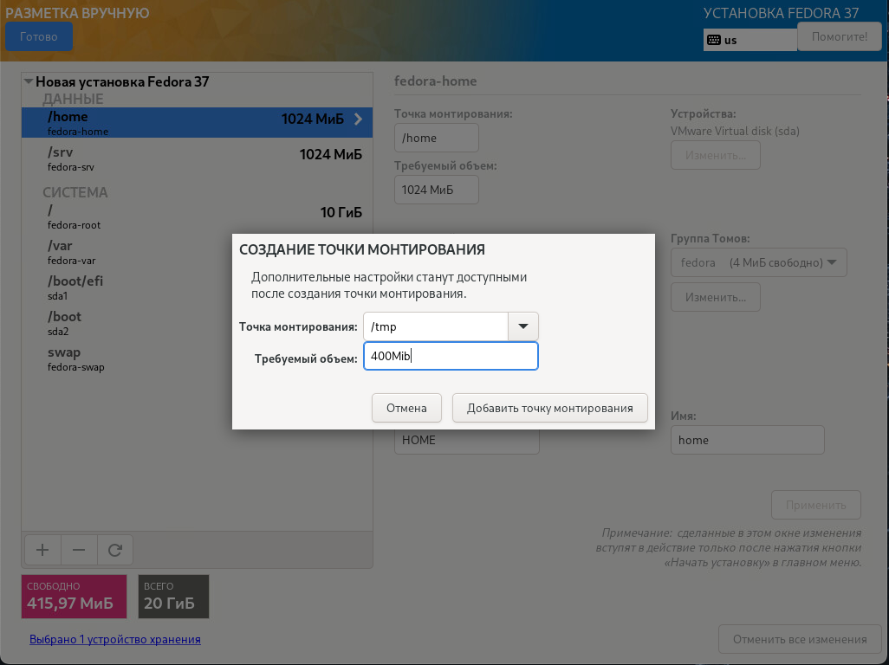

1.9. Подтвердите изменения на диске
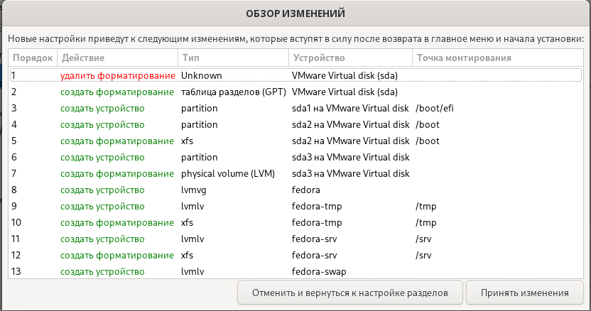

1.10. Задайте имя узла и **включите сетевой адаптер** в разделе "Сеть и имя узла". Убедитесь, что вы получили корректные настройки сети от dhcp или задайте их вручную.
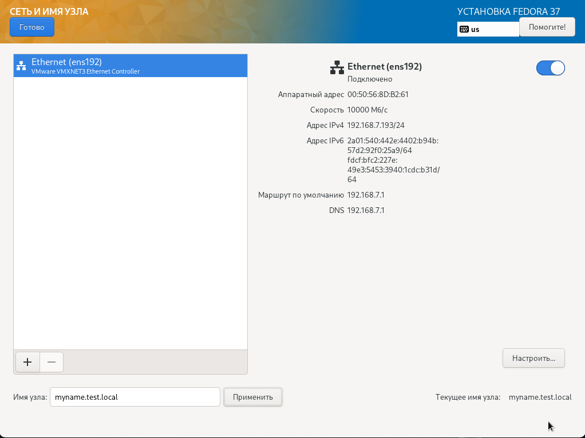

1.11. В "Выборе программ" укажите предпочитаемое **базовое окружение**
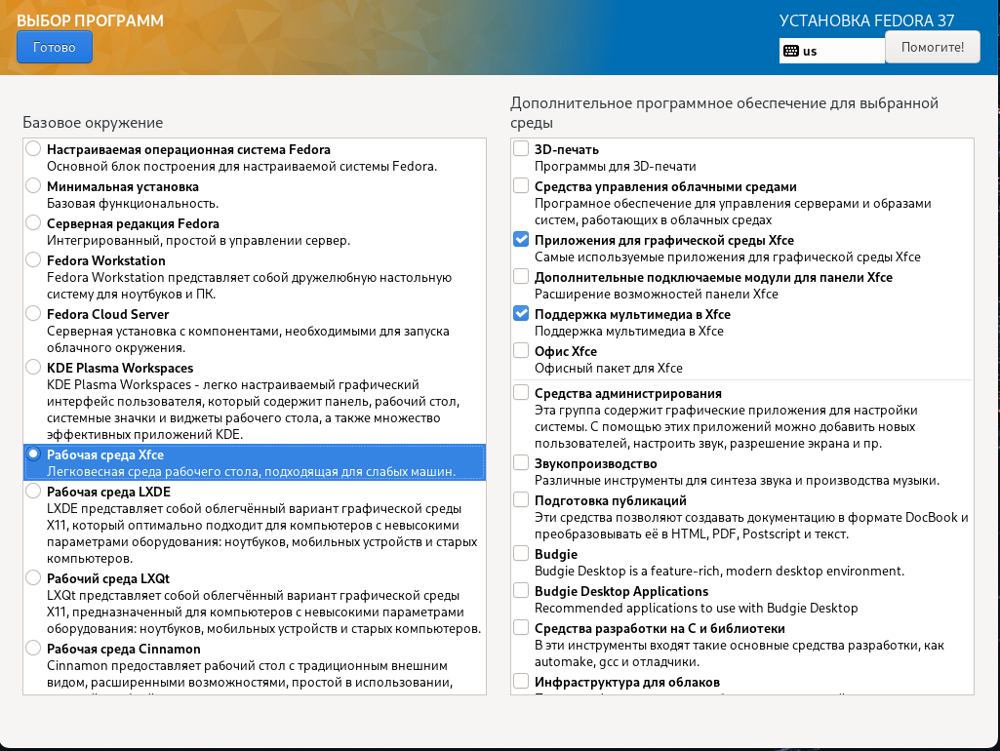

1.12. В качестве дополнительного ПО добавьте **"Средства администрирования"**
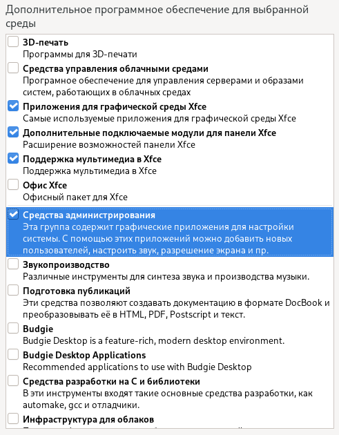

1.13. В качестве дополнительного ПО добавьте **"Средства разработки", "Редакторы", "Управление без монитора"**
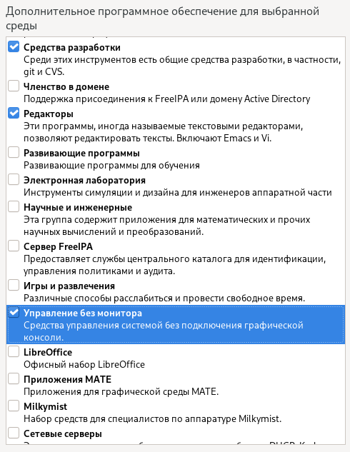

1.14. В качестве дополнительного ПО добавьте **"Системные средства", "Текстовые средства Интернет", "Оконные менеджеры"**
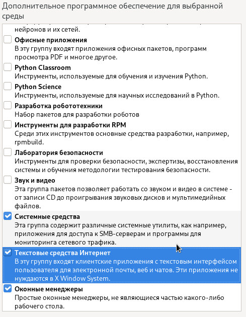

1.15. Создайте первого пользователя **student** c паролем **redhat**
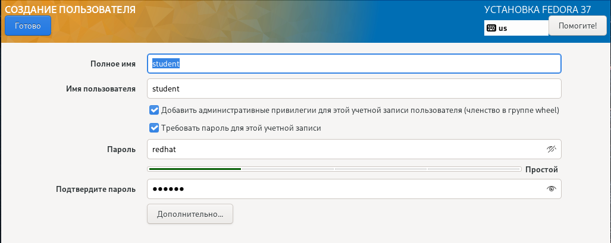

1.16. Убедитесь, что учетная запись **root** отключена
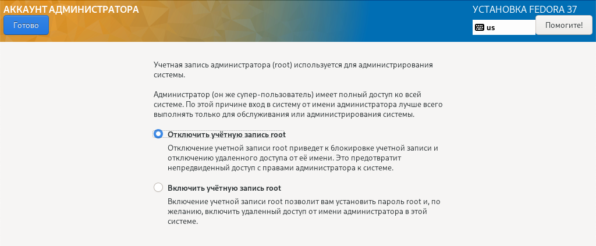

1.17. **Начните установку.** После окончания установки перезагрузите сервер


1.18. Войдите под пользователем **student** в графическое окружение сервера.

---

2. Определите куда обычно монтируется раздел **EFI** и посмотрите его содержимое? (задание выполняется на ВМ "debian")

2.1. Для определения точки монтирования используйте команду `lsblk` 
```
lsblk -f
```
Найдите в выводже команды имя каталога. Это должен быть **/boot/efi**
```
NAME   FSTYPE FSVER LABEL UUID                                 FSAVAIL FSUSE% MOUNTPOINTS
sda
├─sda1 vfat   FAT32       79DB-3498                             505,2M     1% /boot/efi
```
2.2. Просмотрите содержимое этого каталога
```
sudo tree /boot/efi -h
```
2.3. Какой файл самы большой? Это должен быть  **grubx64.efi**. Действительно ли это?

---
3. Помимо разделов подкачки, можно быстро увеличить пространство подкачки в системе Linux с помощью файла подкачки. Создайте файл подкачки и увеличьте swap.

3.1. Создайте файл заполненый нулями размером 200Мб
```sh
dd if=/dev/zero of=swapfile bs=1MiB count=200
```
3.2. Отформатируйте его в формат swap
```sh
mkswap swapfile
```
```console
mkswap: swapfile: insecure permissions 0644, fix with: chmod 0600 swapfile
Setting up swapspace version 1, size = 200 MiB (209711104 bytes)
no label, UUID=fdff701b-b03f-4697-a52a-ec81fd61dc3b
```
и установите рекомендуемые права доступа к файлу
```sh
chmod 0600 swapfile
```
3.3. Проверьте объем раздела подкачки. Запомните это число. Используйте команду `swapon` или `top`.
```
MiB Swap:   1953.0 total,   1953.0 free,      0.0 used.   1328.0 avail Mem
```

3.4. Подключите файл подкачки дополнительно к разделу плодкачки
```sh
sudo swapon swapfile
```
3.5. Проверьте объем раздела подкачки. Сравните с предыдущим значением.

3.6. Перезагрузить систему и снова проверьте объем раздела подкачки. Сравните с предыдущим значением. Подключеный ранее swap-файл должен отсутствовать.

---
4. На диске, отформатированном по схеме разметки **MBR**, определите какой идентификатор имеет системный раздел **EFI**? (задание выполняется на ВМ "debian")
4.1. Определите какие разделы присутсвуют на диске и какой раздел используется для EFI
```sh
lsblk -f
```
это первый раздел.
```
NAME   MAJ:MIN RM  SIZE RO TYPE MOUNTPOINTS
sda      8:0    0   24G  0 disk
├─sda1   8:1    0  512M  0 part /boot/efi
├─sda2   8:2    0  4,8G  0 part /
├─sda3   8:3    0  1,9G  0 part /var
├─sda4   8:4    0  977M  0 part [SWAP]
├─sda5   8:5    0  408M  0 part /tmp
└─sda6   8:6    0 15,5G  0 part /home
sdb      8:16   0   16G  0 disk
sr0     11:0    1 1024M  0 rom
```

4.2. Посмотрите список разделов на диске и найдите тип первого раздела
```sh
sudo gdisk -l /dev/sda
```
```console
Number  Start (sector)    End (sector)  Size       Code  Name
   1            2048         1050623   512.0 MiB   EF00
   2         1050624        11036671   4.8 GiB     8300
   3        11036672        15015935   1.9 GiB     8300
   4        15015936        17016831   977.0 MiB   8200
   5        17016832        17852415   408.0 MiB   8300
   6        17852416        50329599   15.5 GiB    8300
```
Идентификатор равен **EF00** или **0xEF**.
