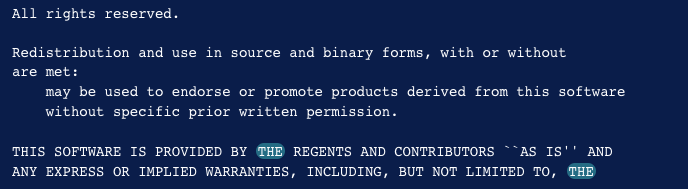

## Практическая работа 15. 
## Регулярные выражения.

> Соответствие LPI101: (103.7 Search text files using regular expressions)

### Вопросы для самопроверки
1. Какое расширенное регулярное выражение будет соответствовать любому адресу электронной почты, например, info@example.org?
    <details>
    <summary>Вариант ответа</summary>

    ```sh
    egrep "\S+@\S+\.\S+"
    ```
    
    </details>
<br> 


2. Какое расширенное регулярное выражение будет соответствовать только любому IPv4-адресу в стандартном точечно-квадратичном формате, например **192.168.15.1**?
    <details>
    <summary>Вариант ответа</summary>

    ```sh
    egrep "[0-9]{1,3}\.[0-9]{1,3}\.[0-9]{1,3}\.[0-9]{1,3}"
    ```
    
    </details>
<br> 


3. Как с помощью команды `grep` перечислить содержимое файла **/etc/services**, отбросив все комментарии (строки, начинающиеся с `#`)?
    <details>
    <summary>Вариант ответа</summary>

    ```
    grep -v ^# /etc/services
    ```
    
    </details>
<br> 


4. Файл **domains.txt** содержит список доменных имен, по одному в строке. Как можно использовать команду `egrep`, чтобы перечислить только домены **.org** или **.com**?
    <details>
    <summary>Вариант ответа</summary>

    ```sh
    egrep ".org$|.com$" domains.txt
    ```
    
    </details>
<br> 


5. Команда `less` является стандартным пагинатором для отображения длинных текстовых файлов в среде shell. Набрав `/`, можно ввести регулярное выражение в строку поиска для перехода к первому соответствующему совпадению. Чтобы остаться в текущей позиции документа и выделять только соответствующие совпадения, какую комбинацию клавиш следует ввести в строке поиска?
    <details>
    <summary>Вариант ответа</summary>

    Нажатие клавиш `Ctrl + K` перед вводом поискового выражения.
    
    </details>
<br> 


6. В меньшей степени, как можно отфильтровать вывод, чтобы отображались только строки, соответствующие регулярному выражению?
    <details>
    <summary>Вариант ответа</summary>

    Нажав клавишу `&` и введя поисковое выражение.
    
    </details>
<br> 


7. Какую опцию следует задать для `grep`, чтобы правильно отфильтровать вывод, полученный командой `find`, выполненной с опцией `-print0`?
   
    <details>
    <summary>Вариант ответа</summary>

    Опция `-z` или `--null-data`, как в выражении `find . -print0 | grep -z`.
    
    </details>
<br> 


8. Какую опцию следует задать для `grep`, чтобы он подсчитывал совпадающие строки, а не выводил их на экран?
    <details>
    <summary>Вариант ответа</summary>

    Опция `-c`
    
    </details>
<br> 


---
### Практические задания

1. Практическое применение утилиты sed.

1.1. Если у вас нет локальной копии лицензии BSD, создайте ее самостоятельно с помощью этой команды:

```
cat << 'EOF' > BSD
Copyright (c) The Regents of the University of California.
All rights reserved.

Redistribution and use in source and binary forms, with or without
modification, are permitted provided that the following conditions
are met:
1. Redistributions of source code must retain the above copyright
   notice, this list of conditions and the following disclaimer.
2. Redistributions in binary form must reproduce the above copyright
   notice, this list of conditions and the following disclaimer in the
   documentation and/or other materials provided with the distribution.
3. Neither the name of the University nor the names of its contributors
   may be used to endorse or promote products derived from this software
   without specific prior written permission.

THIS SOFTWARE IS PROVIDED BY THE REGENTS AND CONTRIBUTORS ``AS IS'' AND
ANY EXPRESS OR IMPLIED WARRANTIES, INCLUDING, BUT NOT LIMITED TO, THE
IMPLIED WARRANTIES OF MERCHANTABILITY AND FITNESS FOR A PARTICULAR PURPOSE
ARE DISCLAIMED.  IN NO EVENT SHALL THE REGENTS OR CONTRIBUTORS BE LIABLE
FOR ANY DIRECT, INDIRECT, INCIDENTAL, SPECIAL, EXEMPLARY, OR CONSEQUENTIAL
DAMAGES (INCLUDING, BUT NOT LIMITED TO, PROCUREMENT OF SUBSTITUTE GOODS
OR SERVICES; LOSS OF USE, DATA, OR PROFITS; OR BUSINESS INTERRUPTION)
HOWEVER CAUSED AND ON ANY THEORY OF LIABILITY, WHETHER IN CONTRACT, STRICT
LIABILITY, OR TORT (INCLUDING NEGLIGENCE OR OTHERWISE) ARISING IN ANY WAY
OUT OF THE USE OF THIS SOFTWARE, EVEN IF ADVISED OF THE POSSIBILITY OF
SUCH DAMAGE.
EOF
```

1.2. Используйте **sed** для просмотра содержимого файла лицензии **BSD**. По умолчанию **sed** отправляет свои результаты на экран:

```bash
sed '' BSD
```

На экране отобразится лицензия BSD:

```console
Copyright (c) The Regents of the University of California.
All rights reserved.

Redistribution and use in source and binary forms, with or without
modification, are permitted provided that the following conditions
are met:
1. Redistributions of source code must retain the above copyright
    notice, this list of conditions and the following disclaimer.
2. Redistributions in binary form must reproduce the above copyright
    notice, this list of conditions and the following disclaimer in the
    documentation and/or other materials provided with the distribution.
...
...
```

1.3. **sed** может использовать стандартный ввод, а не файл. Передайте выходные данные команды **cat** в sed, чтобы получить тот же результат:

```bash
cat BSD | sed ''
```

Вывод файла:

```console
Copyright (c) The Regents of the University of California.
All rights reserved.

Redistribution and use in source and binary forms, with or without
modification, are permitted provided that the following conditions
are met:
1. Redistributions of source code must retain the above copyright
    notice, this list of conditions and the following disclaimer.
2. Redistributions in binary form must reproduce the above copyright
    notice, this list of conditions and the following disclaimer in the
    documentation and/or other materials provided with the distribution.
. . .
. . .
```

1.4. Явная команда печати в **sed** доступна при использовании символа **p** в одинарных кавычках.

```bash
sed 'p' BSD
```

Вы увидите, что каждая строка файла **BSD** напечатана дважды:

```console
Copyright (c) The Regents of the University of California.
Copyright (c) The Regents of the University of California.
All rights reserved.
All rights reserved.


Redistribution and use in source and binary forms, with or without
Redistribution and use in source and binary forms, with or without
modification, are permitted provided that the following conditions
modification, are permitted provided that the following conditions
are met:
are met:
. . .
. . .
```

1.5. Вы можете очистить результаты, передав параметр **-n** в **sed**, который отключает автоматическую печать:

```bash
sed -n 'p' BSD
```

Вы увидите:

```console
Copyright (c) The Regents of the University of California.
All rights reserved.

Redistribution and use in source and binary forms, with or without
modification, are permitted provided that the following conditions
are met:
1. Redistributions of source code must retain the above copyright
    notice, this list of conditions and the following disclaimer.
2. Redistributions in binary form must reproduce the above copyright
    notice, this list of conditions and the following disclaimer in the
    documentation and/or other materials provided with the distribution.
. . .
. . .
```

1.6. Адреса позволяют вам ориентироваться на определенные части текстового потока. Вы можете указать конкретную строку или даже диапазон строк. Давайте попросим **sed** напечатать **первую строку файла**. Выполните следующую команду:

```bash
sed -n '1p' BSD
```

Вы увидите:

```console
Copyright (c) The Regents of the University of California.
```

1.7. Поместив цифру **1** перед командой печати, вы указали sed номер строки, с которой нужно работать. Вы можете так же легко напечатать пять строк (не забудьте “**-n**”):

```bash
sed -n '1,5p' BSD
```

Вы увидите:

```console
Copyright (c) The Regents of the University of California.
All rights reserved.

Redistribution and use in source and binary forms, with or without
modification, are permitted provided that the following conditions
```

1.8. Вы могли бы указать это по-другому, указав первый адрес, а затем используя смещение, чтобы указать sed, сколько **дополнительных линий** необходимо пройти, например так:

```
sed -n '1,+4p' BSD
```

1.9. Если вы хотите печатать **каждую вторую строку**, укажите **интервал** после символа **~**. Следующая команда выводит все остальные строки в файле BSD, начиная со строки 1:

```
sed -n '1~2p' BSD
```

Вы увидите:

```console
Copyright (c) The Regents of the University of California.

modification, are permitted provided that the following conditions
1. Redistributions of source code must retain the above copyright
2. Redistributions in binary form must reproduce the above copyright
    documentation and/or other materials provided with the distribution.
    may be used to endorse or promote products derived from this software

8><-----------------------------------
```

1.10. Вы можете выполнить **удаление текста** там, где вы ранее указывали печать текста, изменив команду **p** на команду **d**.
sed напечатает все, что не было удалено.

```bash
sed '1~2d' BSD
```

Вы увидите:

```console
All rights reserved.
Redistribution and use in source and binary forms, with or without
are met:
    notice, this list of conditions and the following disclaimer.
    notice, this list of conditions and the following disclaimer in the
1. Neither the name of the University nor the names of its contributors
    without specific prior written permission.
. . .
. . .
```

1.11.  Для **сохранения правок** перенаправим стандартный вывод в файл, подобный этому:

```bash
sed '1~2d' BSD > everyother.txt
```

1.12. Теперь **откройте файл** с помощью **cat**:

```bash
cat everyother.txt
```

1.13. Использование переключателя **-i** приведет к **перезаписи исходного файла**, поэтому вам следует использовать это с осторожностью. Отредактируйте **everyother.txt** файл, который вы только что создали. Давайте еще больше уменьшим размер файла, снова удалив все остальные строки:

```bash
sed -i '1~2d' everyother.txt
```

1.14. Чтобы создать **резервную копию файла** перед редактированием, добавьте расширение резервной копии **.bak** непосредственно после параметра “**-i**”:

```bash
sed -i.bak '1~2d' everyother.txt
```

1.15. **s** - это команда-заменитель. Три косых черты `/` используются для разделения различных текстовых полей. Вы можете использовать другие символы для разграничения полей, если это будет более полезно. Выполните следующую команду, чтобы напечатать URL-адрес с помощью echo и изменить его с помощью sed, используя символ подчеркивания **`_`** в качестве разделителя:

```bash
echo "http://www.example.com/index.html" | sed 's_com/index_org/home_'
```

Это заменяет **`com/index`** на **`org/home`**. На выходе отображается измененный URL-адрес:

Вы увидите:

```console
http://www.example.org/home.html
```

Не забудьте последний разделитель, иначе sed выдаст ошибку. Если вы выполнили эту команду:

```bash
echo "http://www.example.com/index.html" | sed 's_com/index_org/home'
```

Вы увидите:

```console
sed: -e expression #1, char 20: unterminated `s' command
```

1.16. Создайте новый файл, чтобы попрактиковаться в некоторых заменах. Выполните следующую команду, чтобы создать новый текстовый файл с именем **song.txt**:

```bash
echo "this is the song that never ends
yes, it goes on and on, my friend
some people started singing it
not knowing what it was
and they'll continue singing it forever
just because..." > song.txt
```

1.17.  Выполните по-очереди три следующие комманды и сравните результаты:

```bash
sed 's/on/forward/' song.txt
```

```bash
sed 's/on/forward/g' song.txt
```

```bash
sed 's/on/forward/2' song.txt
```

1.18. Затем вы можете передать параметр **p** команде **substitute** для печати строк, в которых произошла замена.

```bash
sed -n 's/on/forward/2p' song.txt
```

1.19. Замена и ссылка на совпадение текстов: подстановочное выражение соответствует от начала строки до последнего экземпляр **`at`**. Выполните следующую комманду:

```bash
sed 's/^.*at/REPLACED/' song.txt
```

1.20. Вы можете использовать символ `&` для представления соответствующего текста в строке замены.

```bash
sed 's/^.*at/(&)/' song.txt
```

Вы увидите:

```console
(this is the song that) never ends
yes, it goes on and on, my friend
some people started singing it
(not knowing what) it was
and they'll continue singing it forever
just because...
```

На каждую группу поискового текста, отмеченную круглыми скобками, можно ссылаться с помощью экранированного ссылочного номера. Например, на первую группу круглых скобок можно ссылаться с помощью `\1`, на вторую - с помощью `\2` и так далее.

1.21. Поменяйте местами первые два слова в каждой строке:

```bash
sed 's/\([a-zA-Z0-9][a-zA-Z0-9]*\) \([a-zA-Z0-9][a-zA-Z0-9]*\)/\2 \1/' song.txt
```

Вы увидите:

```console
is this the song that never ends
yes, goes it on and on, my friend
people some started singing it
knowing not what it was
they and'll continue singing it forever
because just...
```

Как вы можете видеть, результаты не идеальны. Например, во второй строке пропускается первое слово, потому что в нем есть символ, которого нет в нашем наборе символов. Аналогичным образом, он рассматривал they'll как два слова в пятой строке.

1.22. Улучшим регулярное выражение, чтобы оно было более точным:

```bash
sed 's/\([^ ][^ ]*\) \([^ ][^ ]*\)/\2 \1/' song.txt
```

Вы увидите:

```console
Output
is this the song that never ends
it yes, goes on and on, my friend
people some started singing it
knowing not what it was
they'll and continue singing it forever
because... just
```

---
2. Практическое применение утилиты grep.

2.1 Скопируйте файл GPL-3 из каталога M07-text сборника практических заданий или создайте файл с помощью следующей команды:

```bash
cat << 'EOF' > BSD
Copyright (c) The Regents of the University of California.
All rights reserved.

Redistribution and use in source and binary forms, with or without
modification, are permitted provided that the following conditions
are met:
1. Redistributions of source code must retain the above copyright
notice, this list of conditions and the following disclaimer.
1. Redistributions in binary form must reproduce the above copyright
notice, this list of conditions and the following disclaimer in the
documentation and/or other materials provided with the distribution.
1. Neither the name of the University nor the names of its contributors
may be used to endorse or promote products derived from this software
without specific prior written permission.

THIS SOFTWARE IS PROVIDED BY THE REGENTS AND CONTRIBUTORS ``AS IS'' AND
ANY EXPRESS OR IMPLIED WARRANTIES, INCLUDING, BUT NOT LIMITED TO, THE
IMPLIED WARRANTIES OF MERCHANTABILITY AND FITNESS FOR A PARTICULAR PURPOSE
ARE DISCLAIMED.  IN NO EVENT SHALL THE REGENTS OR CONTRIBUTORS BE LIABLE
FOR ANY DIRECT, INDIRECT, INCIDENTAL, SPECIAL, EXEMPLARY, OR CONSEQUENTIAL
DAMAGES (INCLUDING, BUT NOT LIMITED TO, PROCUREMENT OF SUBSTITUTE GOODS
OR SERVICES; LOSS OF USE, DATA, OR PROFITS; OR BUSINESS INTERRUPTION)
HOWEVER CAUSED AND ON ANY THEORY OF LIABILITY, WHETHER IN CONTRACT, STRICT
LIABILITY, OR TORT (INCLUDING NEGLIGENCE OR OTHERWISE) ARISING IN ANY WAY
OUT OF THE USE OF THIS SOFTWARE, EVEN IF ADVISED OF THE POSSIBILITY OF
SUCH DAMAGE.
EOF
```

```bash
curl -o GPL-3 https://www.gnu.org/licenses/gpl-3.0.txt
```

2.2. Выполните следующую команду, чтобы использовать **grep** для поиска каждой строки, содержащей слово GNU:

```bash
grep "GNU" GPL-3
```


2.3. Если вы хотите, чтобы grep игнорировал “регистр” вашего параметра поиска и выполнял поиск как в верхнем, так и в нижнем регистре, вы можете указать опцию **-i** или **--ignore-case**.

Найдите каждый экземпляр слова лицензия (с прописными, строчными или смешанными) в том же файле, что и раньше, с помощью следующей команды:

```bash
grep -i "license" GPL-3
```


2.4. Найдите каждую строку, которая не содержит слова **the** в лицензии BSD, с помощью следующей команды:

```bash
grep -v "the" BSD
```



2.5. Часто бывает полезно знать номер строки, в которой происходят совпадения. Вы можете сделать это, используя опцию **-n** или **--номер строки**. Повторно запустите предыдущий пример с добавлением этого флага:

```bash
grep -vn "the" BSD
```


2.6. Привязки - это специальные символы, которые указывают, где в строке должно произойти совпадение, чтобы оно было допустимым. Выполните следующую команду, чтобы выполнить поиск в файле GPL-3 и найти строки, где GNU встречается в самом начале строки

```bash
grep "^GNU" GPL-3
```


2.7. Эта команда будет соответствовать каждой строке, заканчивающейся словом `and` в файле GPL-3:

```bash
grep "and$" GPL-3
```


2.8. Чтобы сопоставить что-либо в файле GPL-3, содержащее два символа, а затем строку **cept**, вы должны использовать следующий шаблон:

```bash
grep "..cept" GPL-3
```


2.9. Поместив группу символов в квадратные скобки `[` и `]`, вы можете указать, что символом в этой позиции может быть любой символ, найденный в группе квадратных скобок.

Например, чтобы найти строки, содержащие too  или two, вам следует кратко указать эти варианты, используя следующий шаблон:

```bash
grep "t[wo]o" GPL-3
```


2.10. Вы можете заставить шаблон соответствовать чему угодно, кроме символов в квадратных скобках, начав список символов в квадратных скобках с символа **^**. Этот пример похож на pattern .ode, но не будет соответствовать шаблону code:

```bash
grep "[^c]ode" GPL-3
```


2.11. Если вы хотите найти каждую строку, начинающуюся с заглавной буквы, вы можете использовать следующий шаблон:

```bash
grep "^[A-Z]" GPL-3
```


2.12. Чтобы найти каждую строку в файле GPL-3, содержащую открывающую и закрывающую круглые скобки, между которыми только буквы и одиночные пробелы, используйте следующее выражение:

```bash
grep "([A-Za-z ]*)" GPL-3
```


2.13. Бывают случаи, когда вам потребуется выполнить **поиск буквальной точки** или **буквальной открывающей скобки**, особенно при работе с исходным кодом или файлами конфигурации. Поскольку эти символы имеют особое значение в регулярных выражениях, вам нужно “экранировать” эти символы, чтобы сообщить grep, что вы не хотите использовать их особое значение в данном случае.
Вы **экранируете символы**, используя символ обратной косой черты `\` перед символом, который обычно имеет особое значение.

Чтобы **найти любую строку**, начинающуюся с заглавной буквы и заканчивающуюся точкой, используйте следующее выражение, которое исключает конечную точку, чтобы она представляла буквальную точку вместо обычного значения “любой символ”.:

```bash
grep "^[A-Z].*\.$" GPL-3
```


2.14. Чтобы указать чередование, используйте символ канала **`|`**. Они часто используются в рамках группировки в скобках, чтобы указать, что одна из двух или более возможностей должна рассматриваться как совпадающая.

В приведенном ниже тексте вы найдете либо GPL, либо General Public License:
```bash
grep -E "(GPL|General Public License)" GPL-3
```


Чередование позволяет выбирать между более чем двумя вариантами, добавляя дополнительные варианты в пределах группы выбора, разделенные дополнительными символами канала **`|`**.


2.15. Подобно метасимволу **`*`**, который соответствовал предыдущему символу или набору символов ноль или более раз, в расширенных регулярных выражениях доступны другие метасимволы, которые определяют количество вхождений.

Чтобы сопоставить символ ноль или один раз, вы можете использовать символ **`?`**. Это делает символ или наборы символов, которые были раньше, по сути, необязательными.

2.16.  Следующая  команда ищет copyright и right, помещая copy в необязательную группу:

```bash
grep -E "(copy)?right" GPL-3
```


Символ **`+`** соответствует выражению один или несколько раз. Это почти как мета-символ **`*`**, но с символом **`+`** выражение должно совпадать хотя бы один раз. Следующее выражение соответствует строке free плюс один или несколько символов, которые не являются пробелами:

```bash
grep -E "free[^[:space:]]+" GPL-3
```


2.17. Чтобы указать, сколько раз повторяется совпадение, используйте символы фигурной скобки **`{`** и **`}`**. Эти символы позволяют указать точное число, диапазон или верхнюю или нижнюю границы количества совпадений выражения.

2.18. Используйте следующее выражение, чтобы найти все строки в файле GPL-3, содержащие тройные гласные:

```bash
grep -E "[AEIOUaeiou]{3}" GPL-3
```


2.19. Чтобы найти любые слова, содержащие от 16 до 20 символов, используйте следующее выражение:

```bash
grep -E "[[:alpha:]]{16,20}" GPL-3
```


---
3. С помощью расширенного регулярного выражения найдите в текущем каталоге все файлы, не содержащие стандартного суффикса (например, имена файлов, не заканчивающиеся на **.txt** или **.c**)?
```sh
find . -type f -regextype egrep -not -regex '.*\.[[:alnum:]]{1,}$'
```

---
4. Команда `last` выводит список последних вошедших в систему пользователей, включая их исходные IP-адреса. 

4.1 Используйте команду `egrep` для фильтрации вывода `last`, показывая только вхождения IPv4-адреса и отбрасывая всю дополнительную информацию в соответствующей строке?

```sh
last -i | egrep -o '[0-9]{1,3}\.[0-9]{1,3}\.[0-9]{1,3}\.[0-9]{1,3}'
```

---
4.  Создайте HTML-файл test.html со следующим содержимым
```html
<html>
    <head>
        <title>News Site</title>
    </head>
        <body>
            <h1>Headline</h1>
            <p>Information of interest.</p>
        </body>
</html>
```

4.1 Используйте `sed` и удалите все теги из HTML-документа, сохранив только отображаемый текст.

Выражение `s/<[^>]*>//g` заменит любое содержимое, заключенное в `<>`, на пустую строку.
```sh
cat test.html| sed "s/<[^>]*>//g"
```